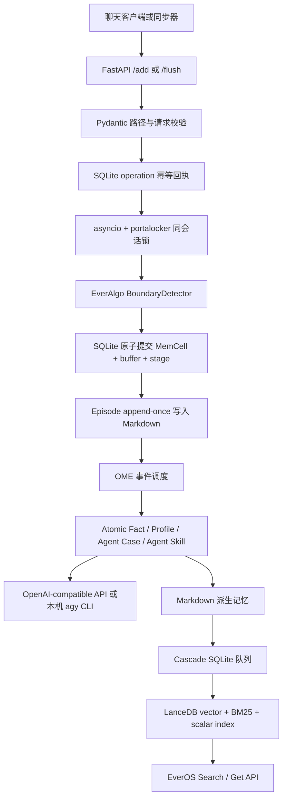

# EverOS Production-Optimized Fork

[中文](#中文说明) · [English](#english-summary)

This document describes the `production-optimized` branch. It is a
production-derived hardening fork based on upstream commit
[`8f175d3`](https://github.com/EverMind-AI/EverOS/commit/8f175d3f8f222fc1a26c943402ce8bb4ea877a1d).
It is intentionally published as a separate branch because the fork's `main`
branch follows the newer upstream 1.2.x line. Compatibility with 1.2.x has not
yet been claimed or implied.

## 中文说明

### 这是什么

这个分支来自一个长期运行的个人 EverOS 部署，目标不是增加更多花哨功能，
而是解决真实运行中反复出现的四类问题：

1. 同一批对话重试后重复写入 Episode、Atomic Fact 或 Agent Case。
2. 服务在“已写 MemCell、未写完成回执”之间退出后，不知道应该从哪里恢复。
3. OME/Cascade 在重启、热加载和长时间空闲后产生重复任务、索引目录膨胀或
   Linux inotify 资源耗尽。
4. 文本提取依赖反代模型账号，认证边界不清晰；远程 API 也缺少轻量级保护。

本分支保留上游的核心设计：**Markdown 是事实源，SQLite 保存状态，
LanceDB 提供检索索引，EverAlgo 提供边界检测和记忆提取算法**。改动集中在
写入正确性、恢复能力、安全边界、提取质量和持续运行稳定性。

### 与原版相比改了什么

| 环节 | 上游基线行为 | 本分支优化 | 主要实现 |
|---|---|---|---|
| API 写入 | `/add`、`/flush` 没有持久化幂等回执 | 可选 `operation_id`；相同请求安全重放，不同请求复用同一 ID 返回冲突；增加无正文的状态查询 | FastAPI + Pydantic + SQLite `memory_operation` 状态机 |
| 同会话并发 | 单进程 `asyncio.Lock` | 锁范围扩展为 `app_id/project_id/session_id`，并增加跨进程文件锁和超时取消 | `asyncio` + `portalocker` + `anyio` |
| 边界提交 | MemCell、buffer、会话状态分别提交 | MemCell、尾部 buffer、会话时间戳和操作阶段放进同一 SQLite 事务 | SQLAlchemy/SQLModel 事务 |
| Markdown 写入 | 重试可能再次追加 | 使用 `(scope, memory kind, parent MemCell)` 作为自然键；首次提交的完整批次获胜，重试返回原 Entry ID | Markdown 回执 + 进程级锁 + 结构完整性校验 |
| Episode 顺序 | 先发下游事件，再写 Episode | 先 append-once 写入事实源，再发事件；崩溃后重放事件可修复漏掉的 outbox | `UserMemoryPipeline` |
| Atomic Fact | 使用通用提示词，输出数量无硬上限 | 强化证据、归因、时间和去重规则；通常 3–8 条，代码硬上限 12 条；禁止复制秘密 | 自定义 Prompt Slot + Pydantic 结构化输出 |
| Agent Case/Skill | 通用成功/失败抽取 | 成功与失败使用不同提示词；只把已验证步骤推广成技能；增加秘密和危险绕过模式的落库前安全门 | EverAlgo extractor + Prompt Slot + 正则安全门 |
| Foresight | 可参与用户记忆派生 | 仍保留上游能力，但生产建议默认关闭；它是推测性派生索引，不应作为事实证据 | OME strategy override |
| OME 重启 | 只按超时扫描旧 RUNNING 任务，重排与标记非原子 | 启动时暂停调度器、稳定 engine ID、重绑遗留任务；先持久化替代任务再标记旧任务 CRASHED | APScheduler + SQLite + UUIDv5 + 双数据库锁 |
| OME 热配置 | watcher 自己做首次加载，可能与 scheduler 启动竞态 | 调度器暂停时先加载一次配置，再 resume 并只监听后续变化 | `watchfiles` + 明确启动阶段 |
| Cascade watcher | 递归监听整个 memory root | 只监听业务 app 目录，排除隐藏 `.index`/LanceDB 树，避免 inotify 耗尽 | watchdog + 周期扫描兜底 |
| Cascade reconcile | pending/processing 的同 mtime 文件会被重复入队 | 任意已知状态只要 mtime 未变就不重复入队 | SQLite queue reconciliation |
| LanceDB 维护 | 空闲 heartbeat 也会制造 optimize 工作 | heartbeat 只修复已经 dirty 且任务丢失的优化器；写入驱动 optimize；更保守地控制临时磁盘增长 | LanceDB optimize/rebuild 调度 |
| 路径安全 | 调用方负责构造正确路径 | DTO 限制路径字符，Markdown writer 再做 `resolve()` 后的根目录包含校验 | Pydantic + `Path.is_relative_to()` |
| HTTP 保护 | 默认仅依赖 loopback/外部网关 | 保留 loopback 默认绑定，并增加可选 Bearer Token 或 token file；一旦配置，除 `/health` 和 OPTIONS 外全部验证 | FastAPI middleware + constant-time compare |
| 文本模型 | 仅 OpenAI-compatible HTTP provider | 保留原 provider，同时增加官方本机 `agy` CLI provider；文本经 stdin，固定 plan+sandbox，严格 JSON 校验，不做账号反代 | `asyncio.subprocess` + 临时输出文件 + Pydantic |

### 每个处理环节用的什么



各层角色：

- **传输层**：FastAPI。负责请求模型、操作 ID、状态查询和可选 Bearer Token。
- **会话切分**：EverAlgo `BoundaryDetector` / `AgentBoundaryDetector`。
- **业务事实源**：Markdown。Episode、Atomic Fact、Profile、Agent Case、Agent
  Skill 都保持可读、可审计。
- **事务和运行状态**：SQLite/SQLModel。保存 buffer、MemCell、操作回执、
  OME run record 和 Cascade queue；不在操作回执中复制原始对话正文。
- **文本提取**：默认仍可使用任何 OpenAI-compatible endpoint；也可以用
  官方安装并登录的 `agy` Linux CLI 在本机直接处理。CLI provider 不提供
  HTTP 反代，不导出账号 token，不把提示词放进命令行或错误消息。
- **离线派生**：OME + APScheduler。用于 Atomic Fact、Profile、Agent
  Case/Skill 等策略，并支持 crash recovery 和热配置。
- **检索索引**：LanceDB，承载向量、BM25 和标量检索；Markdown 仍是事实源。
- **客户端同步**：个人部署使用的 Codex/OpenCode/Antigravity/Trae/Claude/
  Hermes 增量上传器、SSH 地址、systemd timer 和本地检索 skill 属于部署侧，
  **没有放进本仓库**，以免夹带账号、主机信息或个人记忆。

### 幂等写入约定

调用方可以给请求生成稳定 ID：

```text
wire = canonical_json({"kind": "add" | "flush", "payload": request_without_operation_id})
digest = sha256(wire)
operation_id = "evop1-" + kind + "-" + digest
```

同一个 `operation_id`：

- 请求内容相同：返回第一次完成时的回执，并标记 `replayed=true`。
- 请求内容不同：返回 HTTP 409，避免误把另一批对话当成已完成。
- 中途失败且可恢复：在原操作阶段继续，不重新制造已经提交的 MemCell。
- 可通过 `GET /api/v1/memory/operations/{operation_id}` 查询无正文状态。

不传 `operation_id` 时保持上游兼容行为。

### 使用本机 Antigravity CLI 处理文本

先通过产品官方方式在运行 EverOS 的 Linux 主机安装并登录 `agy`。认证文件由
CLI 自己管理，不应复制进本仓库或暴露为反向代理。确认 `agy --version` 可用后：

```dotenv
EVEROS_LLM__PROVIDER=agy_cli
EVEROS_LLM__AGY_EXECUTABLE=agy
EVEROS_LLM__AGY_WORKDIR=~/.local/share/everos/agy-worker
EVEROS_LLM__AGY_AGENT=everos-text
EVEROS_LLM__AGY_MODEL=gemini-3.5-flash-medium
EVEROS_LLM__AGY_TIMEOUT_SECONDS=300
EVEROS_LLM__AGY_MAX_CONCURRENCY=1
```

provider 强制：

- 非 TTY stdin 传入文本，argv/process list 中没有原始对话；
- `--mode plan` 和 `--sandbox`；
- 一个并发请求；
- stdout/stderr 大小上限和超时终止；
- 结构化任务只接受一个 JSON object，并通过 Pydantic schema 校验；
- 不在返回值和异常中泄露 stderr、原始 provider response 或提示词。

`agy` 的安装、登录、可用模型和账号配额由 Antigravity 官方客户端决定，不是
EverOS 的一部分。不要把 CLI 账号包装成公共 API、token bridge 或反代服务。

### HTTP 部署安全

最安全的默认方式仍是只监听 `127.0.0.1`，通过 SSH tunnel 或本机调用。
如果需要额外保护：

```dotenv
EVEROS_API_TOKEN_FILE=/run/secrets/everos-api-token
```

也可以使用 `EVEROS_API_TOKEN`，但 token file 更适合 systemd/Docker secrets。
配置任意一种后，所有非健康检查请求都必须带：

```http
Authorization: Bearer <token>
```

即使前面有本机反向代理也不会绕过验证。公开到不可信网络前仍应使用 TLS、
防火墙、速率限制和成熟网关；内置 token 不是完整的多租户权限系统。

### 本仓库明确不包含

- `.env`、OAuth code、cookie、API key、SSH key、Antigravity 登录态；
- 个人对话、Markdown 记忆库、SQLite/LanceDB 运行数据；
- 服务器 IP、域名、用户名、个人绝对路径；
- 生产备份、补丁包和历史 `.bak` 文件；
- 个人多客户端上传器和定时器。

公开前应运行本分支的测试和秘密扫描。`.gitignore` 已额外排除 `.env.*`、
`*.bak*`、`.secrets/` 和 `credentials/`，但忽略规则不能替代提交前审查。

### 已知边界

- 本分支基于上游 `8f175d3`，不是对 1.2.x 的完成移植。
- OME/Cascade 的默认维护周期来自一个小型个人部署，其他数据规模需要压测。
- 内置 Bearer Token 是单共享密钥，不是用户级 RBAC。
- 提取提示词和正则安全门只能降低风险，不能证明 LLM 输出绝对安全。
- 外部同步器的 exactly-once 语义依赖调用方稳定生成 `operation_id`。

## English summary

This branch hardens an older EverOS production deployment around durable
idempotency, cross-process session serialization, atomic boundary commits,
append-once Markdown receipts, OME crash recovery, Cascade/LanceDB maintenance,
path containment, safer extraction prompts, optional bearer authentication,
and a local official Antigravity CLI text provider.

The fork preserves the upstream storage contract:

- Markdown is the auditable source of truth.
- SQLite holds transactional state, queues, and content-free operation receipts.
- LanceDB is a derived retrieval index.
- EverAlgo supplies boundary detection and extraction algorithms.

Personal credentials, conversations, deployment addresses, timers, sync
scripts, and runtime databases are deliberately excluded. See the Chinese
section above for the full upstream comparison, processing-stage matrix,
configuration, security model, and known limitations.
